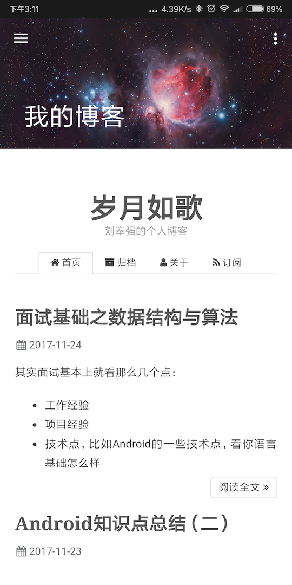
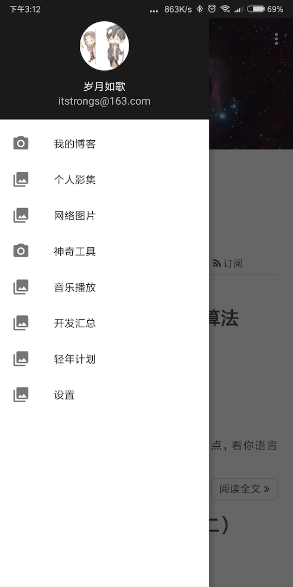
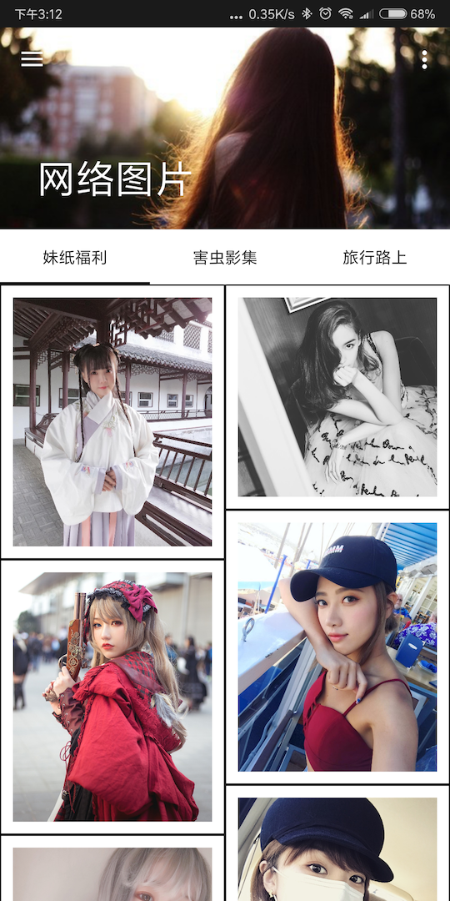
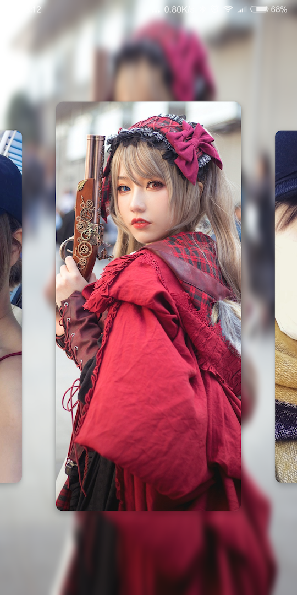
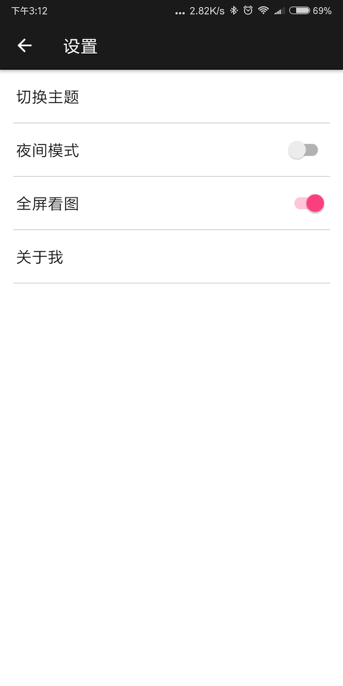

# PersonalApp

初衷是做一个自己展示记录个人成长的经历、爱好、好玩的App，目前能想到的都加进去了，实在不是个好的产品经理，希望能想到更多有趣的东西加进去。

## 主要包括：

* **博客**
* **影集：**展示这些年拍的好的、印象深刻的人和事，整理成一个个影集，每一个影集都要有标题，影集说明，以及每张照片小标题。照片还在整理，目前是传到豆瓣上，再通过爬虫抓取图片。
* **网络图片：**抓取网络上的有趣图片
* **神奇工具：**游戏挂机工具、抢红包插件等，希望开发更多有趣的工具。
* **音乐播放：**初衷主要是市面上找不到一款目录式层级管理播放音乐的App，因为我收藏的音乐太多，目录层级分类复杂。而且想着给App来个背景音乐
* **设置：**给App添加换肤、夜间模式、画廊式看图功能。

## 开发计划：

* 完善已有内容

